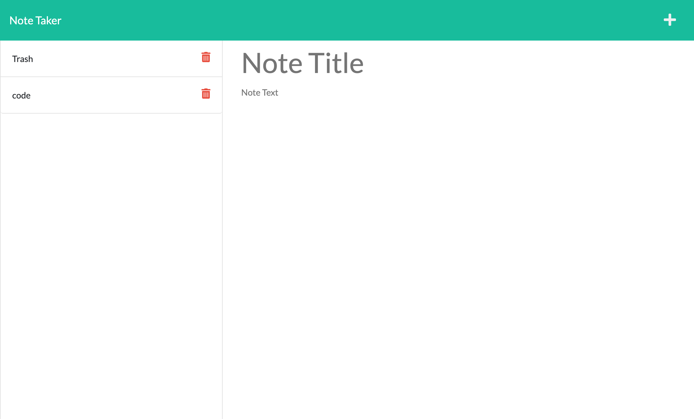

# Note Taker
    
## Description 
In this application you are able to add notes that save to the application

## Table of Contents
- [Installation](#installation)
- [Usage](#usage)
- [Contribution](#contribution)
- [License](#license)
- [Deployed-Link](#deployed-link)
- [Contact Me](#contact-me)

## Installation
1. after cloning the repo and opening it in you vs code your gonna wanna run npm install to install dependencies
2. then run npm watch to start the server
3. after that go to localhost:3001

## Usage
enter notes and delete them when youre finished

## Contribution
Zion Flores

## Tests
no tests

## License
MIT

## Deployed Link
https://peaceful-anchorage-35646.herokuapp.com/
## Contact Me
Linkedin: https://www.linkedin.com/in/zion-flores-684354214/

GitHub: https://github.com/Zi-on

Email: Zioniflores12@yahoo.com